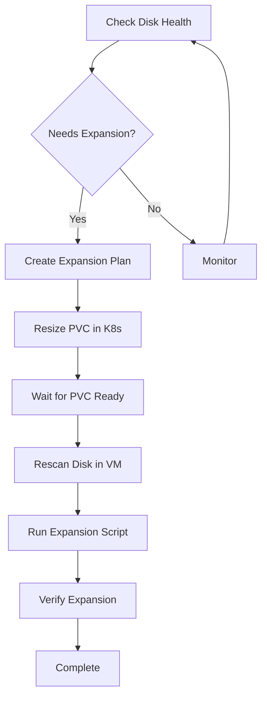

# Disk Management

Zorvia provides comprehensive disk management capabilities for KubeVirt VMs, including PVC expansion, health monitoring, and automated filesystem resizing.

## Features

### 1. Disk Expansion (`disk-expand`)

Expand VM disks seamlessly with integrated PVC resizing and filesystem expansion.

**Usage:**
```bash
# Expand a disk to 100Gi
zorvia disk-expand my-vm root 100Gi

# Show expansion plan without executing
zorvia disk-expand my-vm root 100Gi --plan

# Specify custom PVC name
zorvia disk-expand my-vm root 100Gi --pvc my-custom-pvc
```

**Features:**
- PVC resizing in Kubernetes
- Step-by-step expansion plan
- Progress tracking
- Automatic verification
- Support for multiple storage classes

**Expansion Steps:**
1. Resize PVC in Kubernetes
2. Rescan disk in VM
3. Extend physical volume (if using LVM)
4. Extend logical volume
5. Resize filesystem

### 2. Disk Health Checks (`disk-health`)

Monitor disk usage and get alerts when disks need attention.

**Usage:**
```bash
# Quick health check
zorvia disk-health my-vm

# Detailed disk information
zorvia disk-health my-vm --detailed
```

**Health Status Levels:**
- **Healthy**: < 75% usage (green ✓)
- **Warning**: 75-89% usage (yellow ⚠)
- **Critical**: 90-97% usage (red ✗)
- **Full**: ≥ 98% usage (red ✗)

**Features:**
- Real-time disk usage monitoring
- Automatic health status detection
- Expansion recommendations
- Configurable thresholds
- Alert generation

**Example Output:**
```
╭─────────────────────────────────────╮
│  Disk Health: my-vm                 │
╰─────────────────────────────────────╯

Overall Status: ⚠ WARNING

Disk Details:
  ✓ /
    Size:       100Gi
    Used:       75Gi (75.0%)
    Available:  25Gi
    Filesystem: ext4
    Device:     /dev/vda1

  ✗ /data
    Size:       200Gi
    Used:       180Gi (90.0%)
    Available:  20Gi
    Filesystem: xfs
    Device:     /dev/vdb1
    → Recommended size: 180Gi

Alerts:
  ⚠ Disk /data usage is high (90.0% used, 20Gi available)
    Consider expanding disk or cleaning up unused data

ℹ Use 'zorvia disk-expand' to expand disks
```

### 3. Expansion Scripts (`disk-script`)

Generate automated filesystem expansion scripts for different configurations.

**Usage:**
```bash
# Generate script for LVM with ext4
zorvia disk-script --filesystem lvm --device /dev/vda

# Generate script for XFS on LVM
zorvia disk-script --filesystem lvm-xfs --device /dev/vda

# Generate script for direct ext4 partition
zorvia disk-script --filesystem ext4 --device /dev/sda

# Save to file
zorvia disk-script --filesystem lvm --device /dev/vda --output expand.sh

# Generate dry-run script
zorvia disk-script --filesystem lvm --device /dev/vda --dry-run
```

**Supported Filesystems:**
- `ext4` - Direct ext4 partition
- `xfs` - Direct XFS partition
- `btrfs` - Btrfs filesystem
- `lvm` or `lvm-ext4` - LVM with ext4
- `lvm-xfs` - LVM with XFS

**Script Features:**
- Root permission checks
- Disk rescan automation
- Partition growth (growpart)
- LVM expansion (pvresize, lvextend)
- Filesystem resizing (resize2fs, xfs_growfs)
- Pre and post verification
- Dry-run mode for testing

**Example Generated Script:**
```bash
#!/bin/bash
# Automated Filesystem Expansion Script
# Generated by Zorvia

set -e  # Exit on error

echo "=== Pre-Flight Checks ==="

# Check if running as root
if [ "$EUID" -ne 0 ]; then
    echo "Error: This script must be run as root"
    exit 1
fi

echo "=== Rescanning disk: /dev/vda ==="
echo 1 | tee /sys/class/block/vda/device/rescan
sleep 2

echo "=== LVM Expansion ==="
pvresize /dev/vda3
lvextend -l +100%FREE /dev/mapper/vg-root
resize2fs /dev/mapper/vg-root

echo "=== Verification ==="
df -h
lsblk
```

**One-Liner Commands:**

The tool also generates convenient one-liner commands:

```bash
# LVM with ext4
echo 1 | sudo tee /sys/class/block/vda/device/rescan && \
sudo pvresize /dev/vda3 && \
sudo lvextend -l +100%FREE /dev/mapper/vg-root && \
sudo resize2fs /dev/mapper/vg-root

# Direct ext4 partition
echo 1 | sudo tee /sys/class/block/sda/device/rescan && \
sudo growpart /dev/sda 1 && \
sudo resize2fs /dev/sda1

# XFS on LVM
echo 1 | sudo tee /sys/class/block/vda/device/rescan && \
sudo pvresize /dev/vda3 && \
sudo lvextend -l +100%FREE /dev/mapper/vg-root && \
sudo xfs_growfs /
```

### 4. Disk Usage Statistics (`disk-usage`)

View disk usage statistics across VMs.

**Usage:**
```bash
# Show usage for all VMs
zorvia disk-usage

# Show usage for specific VM
zorvia disk-usage --vm my-vm

# Sort by usage percentage
zorvia disk-usage --sort-by usage

# Sort by size
zorvia disk-usage --sort-by size

# JSON output
zorvia disk-usage --output json
```

**Sort Options:**
- `name` - Sort by VM/disk name (default)
- `usage` - Sort by usage percentage
- `size` - Sort by total size
- `available` - Sort by available space

**Output Formats:**
- `table` - Formatted table (default)
- `json` - JSON format
- `yaml` - YAML format

## Configuration

### Health Check Thresholds

Customize health check thresholds in your code:

```rust
use disk::{DiskHealthConfig, DiskHealthCheck};

let config = DiskHealthConfig {
    warning_threshold: 70.0,   // Default: 75.0
    critical_threshold: 85.0,  // Default: 90.0
    full_threshold: 95.0,      // Default: 98.0
    min_free_space_gb: 10.0,   // Default: 5.0
};

let checker = DiskHealthCheck::new(config);
```

### Expansion Configuration

```rust
use disk::{DiskConfig, DiskExpansion};

let config = DiskConfig::new("root", "my-pvc")
    .with_sizes("50Gi", "100Gi");

let expansion = DiskExpansion::new("default");
let plan = expansion.create_plan("my-vm", &config)?;
```

## Integration with KubeVirt

### PVC Expansion Requirements

1. **StorageClass Configuration:**
   ```yaml
   apiVersion: storage.k8s.io/v1
   kind: StorageClass
   metadata:
     name: expandable-storage
   provisioner: kubernetes.io/cinder
   allowVolumeExpansion: true  # Required for expansion
   ```

2. **PVC Expansion:**
   ```bash
   # Zorvia handles this automatically
   zorvia disk-expand my-vm root 100Gi

   # Or manually with kubectl
   kubectl patch pvc my-pvc -p '{"spec":{"resources":{"requests":{"storage":"100Gi"}}}}'
   ```

3. **Filesystem Expansion in VM:**
   ```bash
   # Generate and run expansion script
   zorvia disk-script --filesystem lvm --device /dev/vda --output expand.sh
   chmod +x expand.sh
   sudo ./expand.sh
   ```

### Workflow



## Best Practices

### 1. Regular Health Checks

Schedule regular disk health checks:

```bash
# Check daily with cron
0 9 * * * zorvia disk-health my-vm --detailed | mail -s "VM Disk Health" admin@example.com
```

### 2. Proactive Expansion

Expand disks before they reach critical levels:

```bash
# Check and expand if needed
if zorvia disk-health my-vm | grep -q "WARNING\|CRITICAL"; then
    zorvia disk-expand my-vm root 100Gi
fi
```

### 3. Test Expansion Scripts

Always test expansion scripts in dry-run mode first:

```bash
# Generate dry-run script
zorvia disk-script --filesystem lvm --device /dev/vda --dry-run > test-expand.sh

# Review the script
cat test-expand.sh

# Run in dry-run mode
chmod +x test-expand.sh
sudo ./test-expand.sh
```

### 4. Backup Before Expansion

Create a snapshot before expanding critical disks:

```bash
# Create snapshot
zorvia snapshot-create my-vm --name pre-expansion-backup

# Expand disk
zorvia disk-expand my-vm root 100Gi

# Verify and delete snapshot if successful
zorvia snapshot-delete pre-expansion-backup
```

### 5. Monitor After Expansion

Verify successful expansion:

```bash
# Check health after expansion
zorvia disk-health my-vm --detailed

# Verify filesystem size
df -h

# Check PVC status
kubectl get pvc -n default
```

## Troubleshooting

### PVC Expansion Stuck

**Problem:** PVC remains in "Resizing" state

**Solution:**
```bash
# Check PVC conditions
kubectl describe pvc my-pvc

# Check if VM is running (some storage requires VM restart)
zorvia restart my-vm

# Force rescan
kubectl delete pod -l kubevirt.io/vm=my-vm
```

### Filesystem Not Expanding

**Problem:** PVC expanded but filesystem size unchanged

**Solution:**
```bash
# Check if VM sees new size
lsblk

# Rescan disk manually
echo 1 | sudo tee /sys/class/block/vda/device/rescan

# Run expansion script
zorvia disk-script --filesystem lvm --device /dev/vda --output expand.sh
chmod +x expand.sh
sudo ./expand.sh
```

### LVM Not Detecting New Space

**Problem:** pvresize fails or doesn't detect new space

**Solution:**
```bash
# Rescan SCSI bus
echo "- - -" | sudo tee /sys/class/scsi_host/host*/scan

# Check partition table
sudo fdisk -l /dev/vda

# Extend partition first
sudo growpart /dev/vda 3

# Then resize PV
sudo pvresize /dev/vda3
```

### StorageClass Doesn't Support Expansion

**Problem:** StorageClass has `allowVolumeExpansion: false`

**Solution:**
```bash
# Create new StorageClass with expansion enabled
cat <<EOF | kubectl apply -f -
apiVersion: storage.k8s.io/v1
kind: StorageClass
metadata:
  name: expandable-storage
provisioner: $(kubectl get sc <old-sc> -o jsonpath='{.provisioner}')
allowVolumeExpansion: true
parameters:
  # Copy parameters from old StorageClass
EOF

# Create new PVC with expandable StorageClass
# Migrate data and update VM spec
```

## Advanced Usage

### Custom Expansion Plans

```rust
use disk::{ExpansionPlan, ExpansionStep};

let mut plan = ExpansionPlan::new("my-vm", &config);

// Add custom step
plan.steps.push(ExpansionStep {
    step_number: 6,
    description: "Notify monitoring system".to_string(),
    command: "curl -X POST https://monitoring.example.com/notify".to_string(),
    completed: false,
});
```

### Batch Disk Expansion

```bash
# Expand all disks in namespace
for vm in $(zorvia list --output json | jq -r '.[].name'); do
    echo "Checking $vm..."
    if zorvia disk-health $vm | grep -q "WARNING\|CRITICAL"; then
        echo "Expanding $vm..."
        zorvia disk-expand $vm root 100Gi
    fi
done
```

### Integration with Monitoring

```bash
# Export metrics for Prometheus
zorvia disk-usage --output json | jq -r '.[] |
    "disk_usage{vm=\"\(.vm)\",mount=\"\(.mount)\"} \(.usage_percent)"'
```

## API Reference

### DiskInfo

```rust
pub struct DiskInfo {
    pub name: String,
    pub mount_point: String,
    pub size: String,
    pub used: String,
    pub available: String,
    pub usage_percent: f64,
    pub filesystem: String,
    pub device: String,
}

impl DiskInfo {
    pub fn parse_size(size_str: &str) -> u64
    pub fn format_size(bytes: u64) -> String
    pub fn needs_expansion(&self, threshold: f64) -> bool
}
```

### DiskHealthCheck

```rust
pub struct DiskHealthCheck {
    config: DiskHealthConfig,
}

impl DiskHealthCheck {
    pub fn with_defaults() -> Self
    pub fn check_disk(&self, disk: &DiskInfo) -> DiskHealthStatus
    pub fn check_vm(&self, vm_name: &str, disks: Vec<DiskInfo>) -> DiskHealth
    pub fn recommend_expansion_size(&self, disk: &DiskInfo, target_usage: f64) -> String
}
```

### ExpansionPlan

```rust
pub struct ExpansionPlan {
    pub vm_name: String,
    pub disk_name: String,
    pub current_size: String,
    pub target_size: String,
    pub steps: Vec<ExpansionStep>,
    pub status: ExpansionStatus,
}

impl ExpansionPlan {
    pub fn complete_step(&mut self, step_number: usize)
    pub fn next_step(&self) -> Option<&ExpansionStep>
    pub fn progress(&self) -> u8
}
```

### ScriptGenerator

```rust
pub struct ScriptGenerator;

impl ScriptGenerator {
    pub fn generate(config: &ExpansionScript) -> String
    pub fn generate_oneliner(filesystem_type: &FilesystemType, device: &str) -> String
}
```

## Examples

See [examples/](examples/) directory for complete examples:
- [disk-expansion-workflow.sh](examples/disk-expansion-workflow.sh)
- [health-monitoring.sh](examples/health-monitoring.sh)
- [automated-expansion.sh](examples/automated-expansion.sh)
