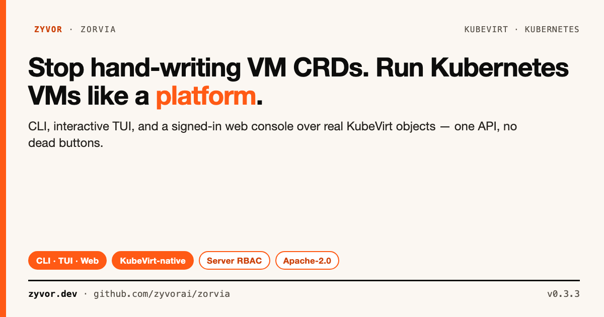
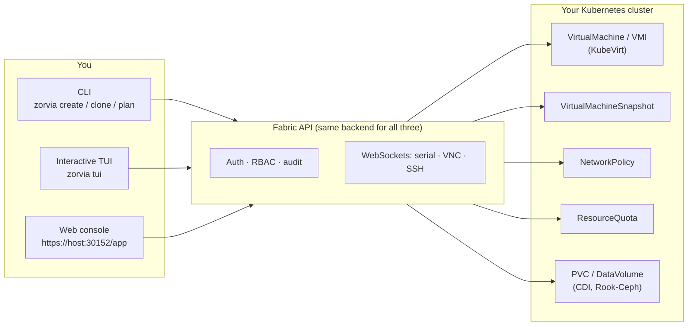

# Zorvia

[](https://github.com/zyvorai/zorvia/actions)
[](LICENSE)
[](CHANGELOG.md)
[](https://kubevirt.io/)
[](https://www.rust-lang.org/)



**The control plane for KubeVirt VMs.**

**[Read the full docs](https://zyvorai.github.io/zorvia/)** — web console, day-2 ops, OIDC, Helm, and feature maturity.

Zorvia is how you **create, operate, and govern** Kubernetes VMs end to end — CLI, interactive TUI, and a signed-in web console on **one API**. Templates and profiles to ship, hotplug and live migrate to run, console/VNC/SSH to reach the guest, RBAC and quotas to stay safe, audit export to prove who did what. Every action hits live cluster objects — not a parallel mock store.

[Try it now](#quick-start) · [Console gallery](#console-gallery) · [Talk to sales](mailto:sales@zyvor.dev) · [Star on GitHub](https://github.com/zyvorai/zorvia) · [Changelog](CHANGELOG.md)

## What you get

| Step | Surface | What it does |
|------|---------|--------------|
| **1 · Create** | Templates · profiles · blueprints | 43 OS templates, workload profiles, multi-VM stacks — no hand-written VM CRDs |
| **2 · Day-2** | Hotplug · migrate · snapshot | CPU/memory/disk/NIC hotplug, live migration, snapshots, disk resize |
| **3 · Access** | Console · VNC · SSH | Authenticated WebSockets into the guest from the signed-in console |
| **4 · Guard** | RBAC · quotas · NetworkPolicy | Server-side roles, `ResourceQuota`, `NetworkPolicy` — not client-only checks |
| **5 · Audit** | Trail · JSONL export | Persistent audit DB + `GET /api/audit/export` for SIEM shippers |


## Contents

- [What you get](#what-you-get)
- [Console gallery](#console-gallery)
- [Install](#install)
- [Quick start](#quick-start)
- [Why teams pick Zorvia](#why-teams-pick-zorvia)
- [Why Zorvia](#why-zorvia)
- [How it stacks up](#how-it-stacks-up)
- [Platform surface](#platform-surface)
- [Day-2 commands](#day-2-commands)
- [Web console & API](#web-console--api)
- [Profiles · blueprints · templates](#profiles--blueprints--templates)
- [Operator toolkit](#operator-toolkit)
- [Config & library](#config--library)
- [Develop](#develop)
- [Roadmap](#roadmap)
- [Project security](#project-security)
- [Get involved](#get-involved)
- [Lab deploy](docs/LAB.md) · [OIDC lab](docs/OIDC_LAB.md) · [Social assets](docs/social/README.md)

## Console gallery

Live UI captures from a lab deployment (HTTPS NodePort **30152**) — not mockups:


---

## Install

```bash
git clone https://github.com/zyvorai/zorvia.git
cd zorvia
cargo install --path . --features web   # `web` is the default feature
# or: cargo build --release --features web → target/release/zorvia
```

Requires Rust **1.89+**, a kubeconfig, and a cluster with **KubeVirt** (CDI optional for golden images / CDI clone).

**Helm (cluster install):**

```bash
helm upgrade --install zorvia charts/zorvia -n zorvia-system --create-namespace \
  -f charts/zorvia/values-lab.yaml
```

Production values: `charts/zorvia/values-production.yaml`. Lab remote deploy: [docs/LAB.md](docs/LAB.md).

---

## Quick start

```bash
# Size from a profile, then create
zorvia profile database
zorvia create prod-db \
  --template ubuntu-22.04 \
  --cpus 6 --memory 16Gi --disk-size 200Gi
zorvia start prod-db
zorvia wait-ready prod-db --timeout 120
zorvia guest-insight prod-db
zorvia status                 # platform components + features
zorvia status prod-db --watch
```

Multi-VM stack:

```bash
zorvia blueprints
zorvia deploy lamp --prefix myapp --start
zorvia list
```

Web console (HTTPS NodePort **30152**, self-signed — use `curl -sk`):

```bash
./scripts/deploy-remote.sh <host> sus --quick
# or: make deploy-remote H=<host> U=sus ARGS=--quick
open https://<HOST>:30152/app
```

| Port | Role |
|------|------|
| **30152** | Cluster front door (UI + API) |
| **5151** | In-pod listen / `zorvia api-serve --tls --port 5151` |
| **8080** | Config-file default when `--port` is omitted |

```bash
# Health + login + list VMs
curl -sk https://HOST:30152/api/v1/health | jq .
TOKEN=$(curl -sk -X POST https://HOST:30152/api/v1/auth/login \
  -H 'Content-Type: application/json' \
  -d '{"username":"admin","password":"…"}' | jq -r .token)
curl -sk -H "Authorization: Bearer $TOKEN" https://HOST:30152/api/vms | jq .
curl -sk -H "Authorization: Bearer $TOKEN" \
  'https://HOST:30152/api/audit/export?format=jsonl' | head
```

Lab admin password comes from the `zorvia-auth` Secret (printed once on first deploy) — see [docs/LAB.md](docs/LAB.md). Change credentials before anything shared.

---

## Why teams pick Zorvia

KubeVirt is excellent at running VMs. The missing piece is the control plane
around them: who can create what, how you hotplug and migrate without
downtime, how you reach the guest, and how you prove who did what.

Zorvia is that control plane — **one real backend** behind a CLI, a TUI, and
a web console, all driving actual Kubernetes objects (`ResourceQuota`,
`NetworkPolicy`, `VirtualMachineSnapshot`, real Node capacity, real KubeVirt
migration phases). If a page shows a number, it came from the cluster. If a
button says it does something, it does it.

Try it in five minutes with the quickstart above, or [talk to us](#get-involved)
about running it in production.

## Why Zorvia

| Need | Zorvia |
|------|--------|
| Ship without custom CRDs | **43** named OS templates |
| Size by workload | **8** resource profiles (apply via `--cpus` / `--memory` / `--disk-size`, or blueprints) |
| Ship a stack | **5** blueprints (LAMP, 3-tier, k8s-cluster, CI/CD, dev-stack) |
| Browser ops | Web console — create, power, console, expose, snapshots |
| Reach the guest | Serial, VNC, in-browser SSH — real pty, password auth works (authenticated WebSockets) |
| Who can do what | Admin/user/viewer accounts (`/app/access-control`), admin-only user management, last-admin-lockout protection |
| Day-2 without downtime | Hotplug CPU/memory/disk/NIC, live migration, disk resize — CLI and web console |
| Catch drift | `zorvia drift` + `zorvia plan` |
| Golden library | quay.io containerdisks + CDI `image-bundle`; web console download applies real DataVolumes |
| Distributed storage | Rook-Ceph pools/filesystems/object stores + StorageClass provisioning (`/app/storage`) |
| GitOps | Terraform scaffold + module over the Fabric API |
| Windows plane | Create VM wizard via Kryton when `KRYTON_URL` is set (`/app/create`, inventory at `/app/windows`) |
| Fit more VMs, safely | Placement Advisor and Capacity Planning on real Node capacity (`/app/placement`, `/app/capacity`) |
| Stop overpaying for idle VMs | Resource Optimizer right-sizing from real usage (`/app/optimizer`) |
| Know what's running where | Zones, Analytics, Service Map (`/app/zones`, `/app/analytics`, `/app/service-map`) |
| Enforce real guardrails | `ResourceQuota` and `NetworkPolicy` CRUD (`/app/quotas`, `/app/network-policies`) |
| Compliance posture | PCI-DSS/HIPAA/SOC2 checks against actual VM specs (`/app/compliance`) |
| Backup & recover | VolumeSnapshots + scheduled backups (`/app/backups`, `/app/backup-scheduler`) |
| Automate power state | Recurring start/stop/restart (`/app/schedules`) |
| Get paged | Alerts + HTTPS webhooks with retry (`/app/alerts`, `/app/webhooks`) |
| Warm capacity | Warm Pools of ready-to-claim VMs (`/app/warm-pools`) |
| Prove who did what | Persistent audit trail + JSONL export (`/api/audit/export`) |
| SSO | Opt-in OIDC Beta (`ZORVIA_OIDC_ENABLED=1`) |

No OpenShift tax. Same VirtualMachines from terminal or browser.



One Fabric API, three front ends, real objects at the other end every time.

## How it stacks up

|  | Hand-rolled `kubectl`/`virtctl` | Generic K8s dashboards | OpenShift Virtualization | **Zorvia** |
|---|---|---|---|---|
| VM create/day-2 without hand-written YAML | ❌ | ⚠️ view-only for VMs | ✅ | ✅ |
| Same capability from CLI, TUI, *and* web | ❌ | ❌ (web only) | ⚠️ web + `virtctl`, no TUI | ✅ |
| Cost/right-sizing, compliance, HA built in | ❌ | ❌ | ⚠️ partial add-ons | ✅ real, on by default |
| Drift detection + change-plan gating | ❌ | ❌ | ❌ | ✅ (`zorvia drift` / `zorvia plan`) |
| Runs on any KubeVirt cluster | ✅ | ✅ | ❌ OpenShift only | ✅ |
| Open source, Apache-2.0 | ✅ | varies | ❌ | ✅ |

Zorvia isn't a general Kubernetes dashboard — it's opinionated about one thing: VMs on KubeVirt, done like a platform.

---

## Platform surface

The quickstart above covers the everyday VM lifecycle. Zorvia's CLI also carries ~178 subcommands across
operator-grade surfaces beyond core VM craft. Per [DEVELOPMENT.md](DEVELOPMENT.md)'s own scope note: these are
**advanced surfaces, not every-cluster guarantees** — the always-supported path is create/day-2/snapshots/drift/plan/golden-images/Terraform;
treat the rest as available, real, and worth exploring, not a promise that every module fits every deployment.

**Security & compliance**

```bash
zorvia security-scan prod-db --scan-type deep
zorvia security-harden prod-db --profile cis
zorvia compliance-check prod-db --framework soc2
zorvia audit-list --security-only
```

**Cost & FinOps**

```bash
zorvia cost-analyze prod-db --period 30d
zorvia cost-optimize --high-priority-only
zorvia cost-waste --waste-type idle
zorvia budget-create platform --amount 5000 --period monthly --alert-threshold 80
```

**Multi-tenancy & access**

```bash
zorvia tenants-create platform-team --owner alice --email alice@example.com
zorvia users-create bob --email bob@example.com --role operator
zorvia users-assign-role bob db-admin --scope namespace:staging
zorvia quotas-create platform-quota --namespace platform --preset large
```

**Backup & disaster recovery**

```bash
zorvia backup-create prod-db --backup-type incremental
zorvia backup-schedule-create nightly --schedule daily --vm prod-db
zorvia backup-restore prod-db-full-20260901 --target prod-db-restore --start
zorvia recovery-plan primary-site-failover
```

**High availability**

```bash
zorvia ha-config prod-db --enable --priority critical --eviction-strategy live-migrate
zorvia ha-status prod-db
zorvia evacuate-node worker-3 --max-parallel 4 --plan
```

**Automation & workflows**

```bash
zorvia automation-create nightly-snapshot --trigger schedule --enable
zorvia workflow-create dr-failover --template disaster-recovery
zorvia workflow-run dr-failover --watch
zorvia schedule-create weekly-backup --rule nightly-snapshot --schedule weekly --enable
```

**Observability & insights**

```bash
zorvia metrics-query cpu_usage --aggregation p95
zorvia alerts-active --severity critical
zorvia insights-generate prod-db --insight-type performance
zorvia trends-analyze cpu_usage --window 24
```

---

## Day-2 commands

```bash
zorvia list
zorvia get prod-db
zorvia status
zorvia status prod-db --watch
zorvia pause prod-db && zorvia resume prod-db
zorvia clone prod-db staging-db --start
zorvia snapshot-create prod-db --name before-upgrade
zorvia health prod-db --detailed
zorvia drift desired.yaml
zorvia plan desired.yaml --vm prod-db
zorvia tui --interactive
```

---

## Web console & API

Signed-in SPA on the same NodePort as the API. Full route map: [docs/WEB_CONSOLE.md](docs/WEB_CONSOLE.md).

| Route | Purpose |
|-------|---------|
| `/app` | Dashboard |
| `/app/create` | Linux (cloud-init) or Windows (Kryton) create |
| `/app/vms/:name` | Power, expose, cloud-init, snapshots, hotplug, resize |
| `/app/vms/:name/console` | Serial · VNC · SSH |
| `/app/snapshots` · `/app/migrations` | Snapshots · live migration |
| `/app/storage` · `/app/volumes` | Rook-Ceph · fleet PVCs |
| `/app/access-control` | Users & roles (admin) |
| `/app/quotas` · `/app/network-policies` | Real `ResourceQuota` / `NetworkPolicy` |
| `/app/templates` · `/app/windows` | OS catalog · Kryton inventory |
| `/app/placement` · `/app/capacity` · `/app/optimizer` | Placement · headroom · right-sizing |
| `/app/backups` · `/app/schedules` · `/app/alerts` | Backup · power cron · alerts |

```text
wss://<HOST>:30152/ws/console/<vm>?token=<jwt>
wss://<HOST>:30152/ws/vnc/<vm>?token=<jwt>
wss://<HOST>:30152/ws/ssh/<vm>?token=<jwt>&user=ubuntu
```

Set `ZORVIA_EXPOSE_HOST` for correct NodePort SSH/VNC/RDP hostnames in the UI.

**Fabric API (same auth as the console):**

| Method | Path | Notes |
|--------|------|-------|
| POST | `/api/v1/auth/login` | JWT |
| GET | `/api/v1/health` · `/api/v1/features` | Liveness · maturity registry |
| GET/POST | `/api/vms` | List / create |
| POST | `/api/vms/:name/start\|stop\|restart` | Power |
| GET/POST | `/api/vms/:name/snapshots` | Snapshots |
| GET | `/api/audit/export` | JSONL audit trail (`?format=jsonl`) |

Password from `zorvia-auth` — not committed defaults. Lab smoke: [docs/LAB.md](docs/LAB.md).

---

## Profiles · blueprints · templates

**Profiles** — look up a shape, then pass resources on `create`:

| Profile | CPU | Memory | Disk | Best for |
|---------|-----|--------|------|----------|
| minimal | 1 | 512Mi | 5Gi | Agents, jump hosts |
| dev | 1 | 2Gi | 10Gi | Learning |
| test | 2 | 4Gi | 20Gi | CI |
| web | 4 | 8Gi | 40Gi | Nginx, static |
| prod | 4 | 8Gi | 40Gi | Production apps |
| database | 6 | 16Gi | 200Gi | Databases |
| microservice | 2 | 4Gi | 20Gi | Node roles |
| high-perf | 8 | 16Gi | 100Gi | ML / heavy I/O |

```bash
zorvia profiles
zorvia profile web
zorvia create api --template fedora-40 --cpus 4 --memory 8Gi --disk-size 40Gi
```

**Blueprints** — multi-VM stacks (profiles applied inside the blueprint):

| Blueprint | VMs | Stack |
|-----------|-----|--------|
| lamp | 2 | MySQL + Apache |
| k8s-cluster | 3 | Control plane + workers |
| 3tier | 3 | DB + app + Nginx |
| cicd | 3 | GitLab + Jenkins + registry |
| dev-stack | 3 | DB + Redis + workspace |

```bash
zorvia blueprint lamp
zorvia deploy lamp --prefix demo --dry-run
zorvia deploy lamp --prefix demo --start
```

**Templates** — 43 named keys (aliases included): Ubuntu, Fedora, CentOS Stream, Debian, RHEL, Alma, Rocky, OpenSUSE, Alpine, Arch, Oracle, FreeBSD, Flatcar, Talos, Windows.

```bash
zorvia templates
zorvia template ubuntu-24.04
```

Catalog: [docs/OS_TEMPLATES.md](docs/OS_TEMPLATES.md) · gallery shot above under [Console gallery](#console-gallery).

---

## Operator toolkit

```bash
zorvia drift desired.yaml
zorvia drift desired.yaml --actual live.yaml --fail-on high -o json
zorvia plan desired.yaml --vm payments-01 --fail-on-downtime
zorvia guest-insight payments-01 --strict
zorvia image-bundle --distro ubuntu --version 22.04 --storage-class fast
zorvia terraform-scaffold --output ./terraform/zorvia-vm --url https://HOST:30152
zorvia inventory
zorvia activity
zorvia maintenance-plan worker-3
zorvia placement-advisor --cpu 2 --memory-gib 4
```

| Topic | Doc |
|-------|-----|
| Drift | [docs/DRIFT_GUARD.md](docs/DRIFT_GUARD.md) |
| Change plans | [docs/CHANGE_PLANNER.md](docs/CHANGE_PLANNER.md) |
| Guest insight | [docs/GUEST_INSIGHT.md](docs/GUEST_INSIGHT.md) |
| Golden images | [docs/GOLDEN_IMAGES.md](docs/GOLDEN_IMAGES.md) |
| OIDC SSO | [docs/OIDC.md](docs/OIDC.md) |
| Feature maturity | [docs/FEATURE_MATURITY.md](docs/FEATURE_MATURITY.md) |
| Enterprise plans | [docs/PHASE5_ENTERPRISE.md](docs/PHASE5_ENTERPRISE.md) |
| Upgrade | [docs/UPGRADE.md](docs/UPGRADE.md) |
| Terraform | [docs/TERRAFORM.md](docs/TERRAFORM.md) |
| Kryton | [docs/KRYTON_INTEGRATION.md](docs/KRYTON_INTEGRATION.md) |
| Inventory | [docs/VCENTER_FEATURE_MATRIX.md](docs/VCENTER_FEATURE_MATRIX.md) |
| Snapshots | [docs/SNAPSHOTS.md](docs/SNAPSHOTS.md) |
| TUI | [docs/INTERACTIVE_TUI.md](docs/INTERACTIVE_TUI.md) |
| Docs index | [docs/README.md](docs/README.md) |
| Command card | [QUICK_REFERENCE.md](QUICK_REFERENCE.md) |

Kryton: set `KRYTON_URL` (+ usually `KRYTON_TOKEN`, `KRYTON_PROJECT`) on the API pod. Tokens never reach the browser.

Terraform: no HashiCorp registry provider binary yet — scaffold + `schema.json` + `terraform/modules/zorvia_vm` ship today.

---

## Config & library

```bash
zorvia validate examples/ubuntu-cloud-init.yaml
zorvia create my-vm --from-file examples/basic-vm.yaml
zorvia generate web --template ubuntu --kubevirt -o web.yaml
zorvia config-init && zorvia config-show
# ~/.config/zorvia/config.toml  ·  /etc/zorvia/config.toml
```

```yaml
name: my-vm
namespace: default
cpu: { cores: 4, sockets: 1, threads: 1 }
memory: { size: 8Gi }
disks:
  - name: rootdisk
    size: 40Gi
    boot_order: 1
    source: { type: Blank }
interfaces:
  - name: default
    network: default
    model: virtio
    network_type: Pod
```

```rust
use zorvia::config::VMConfigBuilder;
use zorvia::output::to_yaml;

fn main() -> anyhow::Result<()> {
    let cfg = VMConfigBuilder::new("my-vm")
        .namespace("production")
        .cpu(4, 1, 1)
        .memory("8Gi")
        .add_blank_disk("rootdisk", "40Gi", 1)
        .add_pod_network("default")
        .label("app", "webserver")
        .build();
    println!("{}", to_yaml(&cfg)?);
    Ok(())
}
```

---

## Develop

```bash
make help
make test
make ci
make status
make release
make tui
make deploy-remote H=<host> U=sus
```

Architecture notes: [DEVELOPMENT.md](DEVELOPMENT.md).

---

## Roadmap

See **[docs/FEATURE_MATURITY.md](docs/FEATURE_MATURITY.md)** for GA / Beta / Experimental / Model-only.
Only **GA** and documented **Beta** paths are production promises. Query
`GET /api/v1/features` on a running API for the live registry.

Capabilities that need genuinely new infrastructure (not yet shipped):

| Area | What's planned | Why it's not here yet |
|------|-----------------|------------------------|
| Disaster recovery | Site failover, cross-site replication | Needs a real DR/replication engine (`dr-replication` is model-only) |
| Certificates & encryption | Cert lifecycle, disk/volume encryption (KMS) | Needs PKI and key-management integration from scratch |
| Image upload / convert | Upload a disk image from your browser, format conversion | Needs a CDI upload-proxy client (TLS, multipart streaming) |
| Autoscaling | Policy-driven automatic VM scaling | Policy engine exists; needs an execution loop against real load |
| Datacenters & resource pools | vCenter-style hierarchical grouping | No equivalent Kubernetes primitive to build on yet |
| Enterprise SSO | OIDC/SAML with PKCE + JWKS | OIDC Beta via `ZORVIA_OIDC_ENABLED=1`; SAML not yet |
| S3 immutable backup / Transiva / GPU-NUMA | Phase 5 plan APIs | [docs/PHASE5_ENTERPRISE.md](docs/PHASE5_ENTERPRISE.md) |

If one of these is a blocker for adopting Zorvia in your environment, that's
exactly the kind of thing worth a conversation — [reach out](#get-involved)
and tell us what you need.

---

## Project security

No `unsafe` on the product path. CORS off unless configured. TLS verification enforced.
Profile/blueprint storage blocks path traversal. API errors are sanitized; auth inputs bounded.

Report privately via [GitHub Security Advisories](https://github.com/zyvorai/zorvia/security/advisories)
or `info@zyvor.dev` — [SECURITY.md](SECURITY.md).

---

## Get involved

### Running this in production?

Production support, SLAs, and Zyvor Enterprise products are licensed
separately. Contact [sales@zyvor.dev](mailto:sales@zyvor.dev) or see
[zyvor.dev](https://zyvor.dev) — tell us your cluster size and what's on your
list from the [Roadmap](#roadmap) above, and we'll tell you what's already
possible today.

### Evaluating it?

Clone it, run the [quickstart](#quick-start), and see for yourself — every
claim in this README maps to a route or command you can hit right now.
Questions, bug reports, and feature requests are welcome as
[GitHub issues](https://github.com/zyvorai/zorvia/issues); if it's useful to
you, a [star on the repo](https://github.com/zyvorai/zorvia) helps others
find it.

### Contributing code?

PRs welcome — see [CONTRIBUTING.md](CONTRIBUTING.md).

### Open source (Apache-2.0)

This repository is licensed under the [Apache License, Version 2.0](LICENSE).
You may use, modify, and run it for personal, lab, and commercial production
use at no charge, subject to Apache-2.0 (preserve notices / NOTICE where required).
See [NOTICE](NOTICE) — Apache-2.0 only (not dual-licensed with MIT).

Built on [KubeVirt](https://kubevirt.io/) and [kube-rs](https://github.com/kube-rs/kube).
