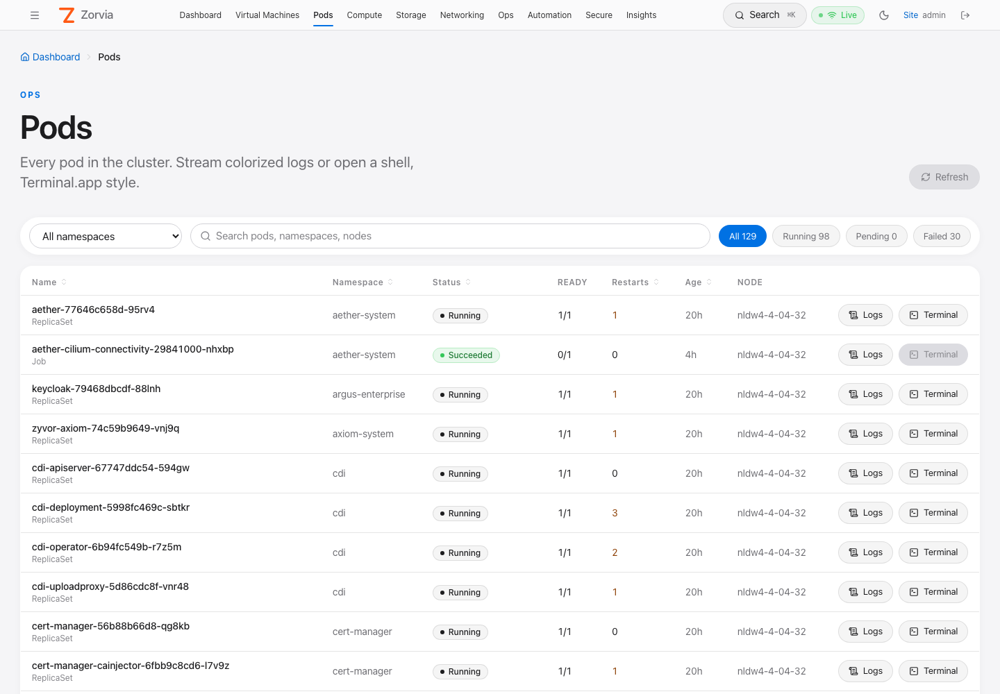
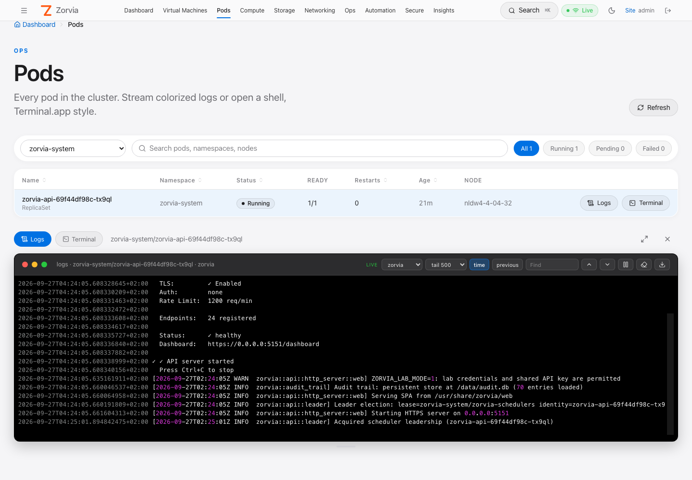
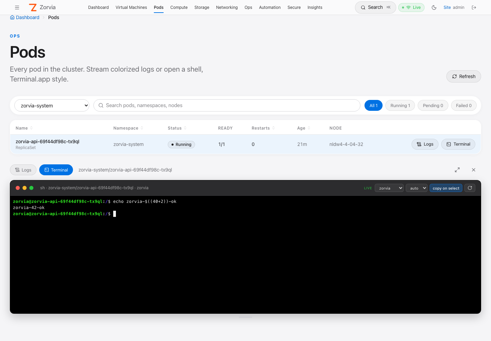
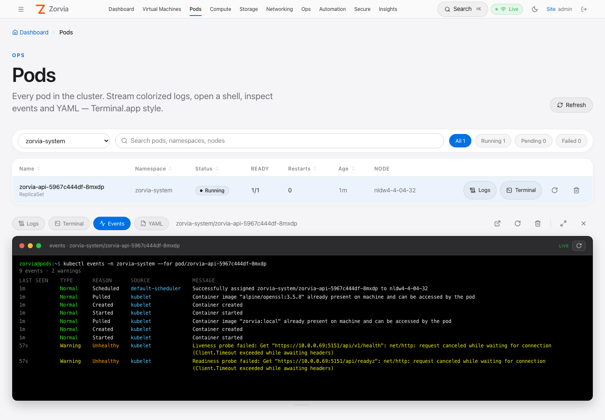
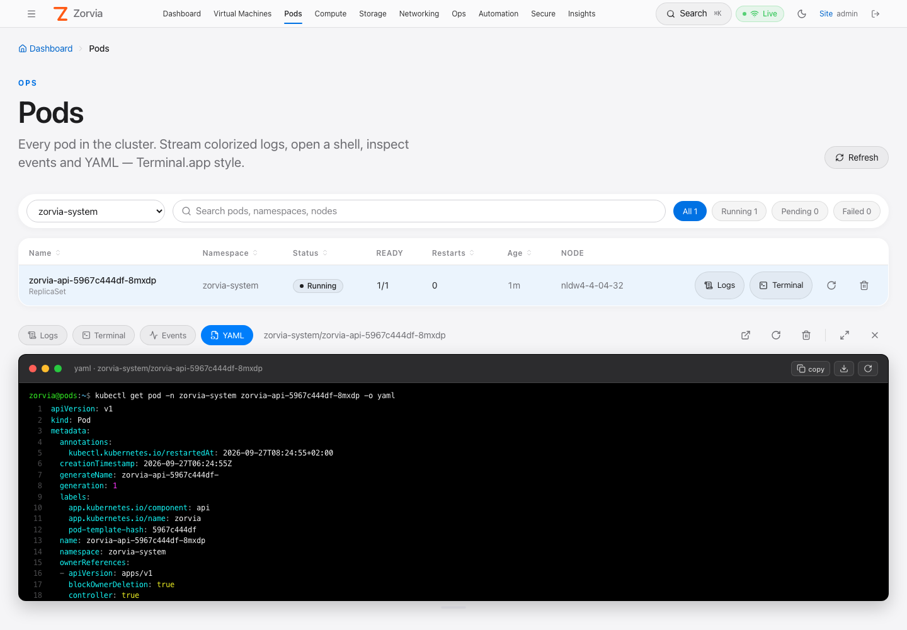

# Pods — inventory, logs and exec

The **Pods** page lists every pod in the cluster and opens a macOS Terminal.app-style
panel with a **live log stream**, an **interactive shell** (`kubectl exec -it`), the pod's
**events**, or its **YAML** — right in the browser. Pods can be **restarted** (when a
controller owns them) or **deleted**, and logs can be popped out into their own **browser
tab**. It is **admin-only** end to end: the nav link, the SPA routes, the REST APIs and
both WebSockets all require the `cluster.admin` permission.



- [Where to find it](#where-to-find-it)
- [Pod list](#pod-list)
- [Logs panel](#logs-panel)
- [Terminal (exec) panel](#terminal-exec-panel)
- [Events and YAML panels](#events-and-yaml-panels)
- [Restart and delete](#restart-and-delete)
- [Logs in a new tab](#logs-in-a-new-tab)
- [HTTP API](#http-api)
- [WebSocket protocol](#websocket-protocol)
- [Security model](#security-model)
- [Kubernetes RBAC](#kubernetes-rbac)
- [Audit trail](#audit-trail)
- [Troubleshooting](#troubleshooting)
- [Testing](#testing)
- [Implementation map](#implementation-map)

## Where to find it

| Entry point | Notes |
|-------------|-------|
| Top nav **Pods** (between *Virtual Machines* and *Compute*) | Hidden for `user` / `viewer` accounts |
| `https://<HOST>:30152/app/pods` | Non-admins who open the URL directly see "Admins only." |
| **Search ⌘K** → "pods" | Command palette |
| `/app/pods/<ns>/<pod>/logs` | Full-window logs for one pod (the panel's ↗ new-tab target) |

If the link is missing after an upgrade, hard-refresh the tab (⌘⇧R) — a tab opened
before the deploy still runs the old bundle.

## Pod list

| Feature | Behavior |
|---------|----------|
| Namespace filter | **All namespaces** (default) or any single namespace from `GET /api/v1/namespaces` |
| Search | Matches pod name, namespace and node |
| Status chips | **All · Running · Pending · Failed** with live counts. *Succeeded/Completed* and *Terminating* are shown in the list but not counted as Pending |
| Columns | Name (+ owner kind, e.g. `ReplicaSet`, `Job`), Namespace, Status, Ready (`ready/total` main containers), Restarts (highlighted when > 0), Age, Node |
| Status text | kubectl-style: a waiting/terminated reason on any main container (`CrashLoopBackOff`, `ImagePullBackOff`, `Error`, `OOMKilled` …) wins over the phase; a pod with a deletion timestamp shows `Terminating` |
| Refresh | Automatic every **10 s**, plus the **Refresh** button in the header |
| Actions | **Logs** (any pod), **Terminal** (enabled only when the pod phase is `Running`), **Restart** ↻ (enabled only for controller-owned pods) and **Delete** 🗑 |

Clicking an action (or a row) opens the bottom **panel**:

- **Logs / Terminal / Events / YAML** chips switch view for the same pod.
- Header buttons: **open logs in a new tab** ↗, **restart**, **delete**.
- **Drag** the grip on the top edge to resize (default 460 px).
- **Maximize** fills the viewport; **Esc** restores.
- **×** closes the panel (the WebSocket closes with it).

## Logs panel



A read-only [xterm.js](https://xtermjs.org/) terminal on a black Terminal.app "Pro"
canvas (SF Mono 12.5 px, Terminal.app ANSI palette). Logs follow in real time.

### Toolbar

| Control | What it does |
|---------|--------------|
| **LIVE** badge | Stream connected |
| Container select | Shown for multi-container pods: main containers first, then init containers; defaults to the first main container |
| `tail 100 / 500 / 2000` | Lines of history to load before following (server clamps to 1–10 000) |
| **time** | Ask the kubelet to prefix each line with an RFC 3339 timestamp |
| **previous** | Logs of the previous (crashed) container instance |
| Find (↑ / ↓) | Incremental search through the scrollback |
| Pause / resume | Freeze the view; incoming lines are buffered and the count shown, then flushed on resume |
| Clear | Clear the screen (the stream keeps running) |
| Download | Save the buffer as `<namespace>_<pod>_<container>.log` |
| Reconnect | Re-open the stream |

Changing container, tail, time or previous reconnects automatically. The browser
keeps the most recent **20 000** lines.

### Colorizing

Lines are colored client-side (`colorizeLogLine` in `web/src/components/terminalTheme.ts`).
Lines that already contain ANSI escapes are passed through untouched.

| Pattern | Color |
|---------|-------|
| Leading RFC 3339 timestamp, klog time (`I0927 01:25:45.123`) | dim grey |
| `ERROR` / `ERR` / `FATAL` / `PANIC` / `CRIT` (and klog `E` / `F`) | bold red |
| `WARN` / `WARNING` (klog `W`) | bold yellow |
| `INFO` / `NOTICE` (klog `I`) | bold cyan |
| `DEBUG` / `TRACE` | dim |
| `level=…` / `lvl=…` / `severity=…` | key cyan, value by level |
| `key=` in logfmt | cyan |
| `"quoted strings"` | green |
| HTTP methods (`GET`, `POST`, …) | bold blue |
| HTTP status codes (only on lines that look like HTTP) | 2xx green · 3xx cyan · 4xx yellow · 5xx bold red |
| JSON lines (`{…}` / `[…]`) | keys cyan · strings green · numbers magenta · `true`/`false`/`null` yellow · `"level"` values by level |

Server notices arrive pre-colored: red `error: …` if the stream cannot start or breaks,
grey `[log stream ended]` when the container exits.

## Terminal (exec) panel



An interactive TTY into the pod — equivalent to `kubectl exec -it <pod> -c <container> -- sh`.

| Control | What it does |
|---------|--------------|
| Container select | Same list as Logs (shown for multi-container pods) |
| Shell `auto / bash / sh` | `auto` runs `bash` when present, otherwise `sh` |
| **copy on select** | Selecting text copies it to the clipboard (toggle) |
| Reconnect | Start a new session |

- `TERM=xterm-256color` is exported, so `top`, `vim`, `less`, colors, and line editing work.
- The terminal follows the panel size — resizing/maximizing sends a resize to the TTY.
- When the shell exits (`exit`, Ctrl-D) you see a grey `[process exited N]` line; press
  **Reconnect** for a new session.
- Distroless images without `/bin/sh` cannot be exec'd into — you'll get an `error`
  message from the API (use Logs instead).

## Events and YAML panels



**Events** — equivalent to `kubectl events -n <ns> --for pod/<pod>`, refreshed every 5 s:

| Column | Rendering |
|--------|-----------|
| LAST SEEN | Relative age, grey |
| TYPE | `Normal` green · `Warning` yellow |
| REASON | Bold (orange for warnings), `×N` in magenta when the event repeated |
| SOURCE | Reporting component (`kubelet`, `default-scheduler`, …), blue |
| MESSAGE | Wrapped; yellow for warnings |

Kubernetes only keeps events for about an hour, so an old healthy pod often shows none.



**YAML** — equivalent to `kubectl get pod -n <ns> <pod> -o yaml`, with `managedFields`
stripped for readability. Line numbers in the gutter; keys cyan, strings green, numbers
magenta, `true`/`false`/`null` yellow, comments and `- ` markers grey (`yamlLineSegments`
in `terminalTheme.ts`). **copy** puts the YAML on the clipboard, **download** saves
`<namespace>_<pod>.yaml`, ↻ reloads.

## Restart and delete

| Action | What happens | Enabled when |
|--------|--------------|--------------|
| **Restart** | The pod is deleted; its controller schedules a fresh replacement (new name, same spec). Same effect as `kubectl delete pod` on a Deployment pod | Pod's controller owner is a `ReplicaSet`, `StatefulSet`, `DaemonSet` or `ReplicationController` |
| **Delete** | `kubectl delete pod` with the default grace period. Controller-owned pods come back; bare pods are gone for good | Always |

Both ask for confirmation. The dialog says whether the pod will come back ("Its
ReplicaSet will create a replacement") or not. Restart is refused server-side with
`409 NOT_RESTARTABLE` for anything else — notably **KubeVirt `virt-launcher` pods**
(owned by a `VirtualMachineInstance`: deleting one stops the VM rather than restarting it;
use the VM's own Restart) and **Job** pods.

If the pod you delete is open in the panel, the panel closes.

## Logs in a new tab

The ↗ button in the panel header opens
`/app/pods/<namespace>/<pod>/logs?container=<c>` in a new browser tab: the same log
terminal filling the window, with a breadcrumb back to **Pods**. The URL is shareable
between admins; if the pod no longer exists (for example after a restart) the page says so.

## HTTP API

All routes need a bearer token (JWT or scoped API token) with `cluster.admin`.

### `GET /api/v1/pods`

| Query | Default | Notes |
|-------|---------|-------|
| `namespace` | all | Omit, empty, or `all` → every namespace; otherwise a DNS-1123 name |

```bash
curl -sk -H "Authorization: Bearer $TOKEN" \
  'https://HOST:30152/api/v1/pods?namespace=zorvia-system' | jq '.pods[0]'
```

```json
{
  "name": "zorvia-api-fb7cd456b-c8vvj",
  "namespace": "zorvia-system",
  "phase": "Running",
  "status": "Running",
  "ready": "1/1",
  "restarts": 0,
  "created": "2026-09-27T01:52:10Z",
  "age_seconds": 1830,
  "node": "nldw4-4-04-32",
  "pod_ip": "10.42.0.117",
  "owner_kind": "ReplicaSet",
  "containers": [
    { "name": "zorvia", "image": "zorvia:local", "init": false, "ready": true, "restarts": 0, "state": "Running" }
  ]
}
```

Response envelope: `{ "pods": [...], "count": N }`, sorted by namespace then name.

### `GET /api/v1/namespaces`

```json
{ "namespaces": ["cdi", "default", "kubevirt", "zorvia-system"] }
```

### `DELETE /api/v1/pods/{namespace}/{pod}`

| Query | Default | Notes |
|-------|---------|-------|
| `grace` | pod's own | Grace period in seconds; `0` force-deletes |

```json
{ "deleted": true, "namespace": "default", "name": "web-7d9c-abcde" }
```

### `POST /api/v1/pods/{namespace}/{pod}/restart`

Deletes the pod only if a recreating controller owns it:

```json
{ "restarted": true, "owner_kind": "ReplicaSet", "owner": "web-7d9c" }
```

### `GET /api/v1/pods/{namespace}/{pod}/events`

```json
{
  "events": [
    {
      "type": "Normal", "reason": "Pulled", "message": "Container image … already present",
      "count": 1, "source": "kubelet",
      "first_seen": "2026-09-27T05:12:01Z", "last_seen": "2026-09-27T05:12:01Z"
    }
  ]
}
```

Sorted oldest → newest by `last_seen` (falls back to `eventTime` for new-style events).

### `GET /api/v1/pods/{namespace}/{pod}/yaml`

```json
{ "yaml": "apiVersion: v1\nkind: Pod\nmetadata:\n  name: …" }
```

### Errors

| Status | Code | When |
|--------|------|------|
| 400 | `INVALID` | Namespace / pod is not a valid Kubernetes name |
| 401 | — | Missing / invalid / revoked token |
| 403 | — | Authenticated but not `cluster.admin` |
| 403 | `FORBIDDEN` | The ServiceAccount lacks the Kubernetes permission (e.g. `pods` delete) |
| 404 | `NOT_FOUND` | Pod does not exist |
| 409 | `NOT_RESTARTABLE` | Restart on a pod without a recreating controller |
| 500 | `LIST_FAILED` / `KUBE_ERROR` | Other Kubernetes API error (message sanitized) |

## WebSocket protocol

Browsers cannot set `Authorization` on a WebSocket upgrade, so the token travels as
`?token=`. Both sockets validate the token **and** the `cluster.admin` permission
before upgrading (HTTP 401 / 403 otherwise), and reject non-DNS-1123 namespace, pod
or container names with 400.

### Logs — `GET /ws/pods/{namespace}/{pod}/logs`

```text
wss://<HOST>:30152/ws/pods/<ns>/<pod>/logs?token=<jwt>&container=<c>&tail=500&timestamps=1&previous=0
```

| Query | Default | Notes |
|-------|---------|-------|
| `token` | — | Required |
| `container` | pod default | Required by Kubernetes for multi-container pods |
| `tail` | `500` | Clamped to 1–10 000 |
| `timestamps` | off | `1` / `true` / `yes` |
| `previous` | off | `1` / `true` / `yes` |

Server → client: one **text** frame per log line (always `follow=true`), plus a WebSocket
ping every 25 s to keep proxies from idling the connection out. Client → server: nothing
(close to stop).

### Exec — `GET /ws/pods/{namespace}/{pod}/exec`

```text
wss://<HOST>:30152/ws/pods/<ns>/<pod>/exec?token=<jwt>&container=<c>&shell=auto
```

| Query | Default | Notes |
|-------|---------|-------|
| `token` | — | Required |
| `container` | pod default | |
| `shell` | `auto` | `auto`, `bash` or `sh` — anything else behaves like `auto` |

The command is **never user-supplied**: the server always runs
`/bin/sh -c "export TERM=xterm-256color; exec <bash|sh>"`.

| Direction | Frame | Payload |
|-----------|-------|---------|
| client → server | binary | Raw keystrokes → TTY stdin |
| client → server | text | `{"type":"resize","cols":120,"rows":40}` (clamped 2–1000) |
| server → client | binary | Raw TTY output (stdout + stderr) |
| server → client | text | `{"type":"exit","code":0}` when the shell exits (`code` may be `null`) |
| server → client | text | `{"type":"error","message":"…"}` if exec could not start |

Minimal client:

```js
const ws = new WebSocket(`wss://${host}:30152/ws/pods/default/web-0/exec?token=${jwt}`)
ws.binaryType = 'arraybuffer'
ws.onmessage = (e) => typeof e.data === 'string'
  ? console.log('control', JSON.parse(e.data))
  : term.write(new Uint8Array(e.data))
term.onData((d) => ws.send(new TextEncoder().encode(d)))
term.onResize(({ cols, rows }) => ws.send(JSON.stringify({ type: 'resize', cols, rows })))
```

## Security model

Exec into arbitrary pods — including `kube-system` and Zorvia itself — is a
cluster-admin-equivalent capability, so the feature is locked down accordingly:

1. **REST RBAC** — `required_permission` in `src/api/auth/permissions.rs` maps every
   `/v1/pods*` and `/v1/namespaces*` request (any method, including GET) to
   `ApiPermission::ClusterAdmin`, ahead of the "reads are allowed" fallback.
   Unit test: `pods_and_namespaces_require_cluster_admin`.
2. **WebSocket RBAC** — `/ws/*` routes sit outside the `/api` middleware, so the pod
   sockets call `authorize_permission(state, token, ApiPermission::ClusterAdmin)`
   themselves (401 missing/invalid token, 403 insufficient permission). Session
   revocation (`token_version`) applies because tokens are resolved through the same
   `resolve_credential` path as REST.
3. **Input validation** — namespace, pod and container names must be DNS-1123
   (lowercase alphanumerics, `-`, `.`; ≤ 253 chars), so nothing path-like reaches the
   Kubernetes URL.
4. **Fixed argv** — the exec command is chosen from three hard-coded launchers.
5. **Restart guard** — restart only deletes pods whose controller recreates them;
   `virt-launcher` (VM) and Job pods are refused with 409.
6. **UI gating** — nav link and routes are admin-only, destructive actions confirm first
   (UX only; the server is the enforcement point).
7. **Audit** — every log view, exec start/end, restart and delete is recorded (below).

Tokens in the WebSocket query string can appear in reverse-proxy access logs; prefer
short-lived JWTs and scrub `token=` in any proxy in front of Zorvia.

## Kubernetes RBAC

The `zorvia` ServiceAccount needs, in addition to its existing `pods` / `events` /
`namespaces` get-list access:

```yaml
- apiGroups: [""]
  resources: ["pods"]
  verbs: ["delete"]          # Restart + Delete
- apiGroups: [""]
  resources: ["pods/log"]
  verbs: ["get"]
- apiGroups: [""]
  resources: ["pods/exec"]
  verbs: ["create", "get"]   # get: WebSocket upgrade; create: SPDY/v5 exec
```

These rules ship in `deploy/k8s.yaml`, `deploy/k3s-zorvia-web.yaml` and the Helm chart
(`charts/zorvia/templates/rbac.yaml`, both cluster-scoped and namespaced modes).
In namespaced mode the all-namespaces list needs cluster-scoped `pods` list; otherwise
pick a namespace the chart grants.

**Existing installs** — re-apply the manifest / `helm upgrade`, or patch the live role:

```bash
kubectl patch clusterrole zorvia --type=json -p='[
  {"op":"add","path":"/rules/-","value":{"apiGroups":[""],"resources":["pods"],"verbs":["delete"]}},
  {"op":"add","path":"/rules/-","value":{"apiGroups":[""],"resources":["pods/log"],"verbs":["get"]}},
  {"op":"add","path":"/rules/-","value":{"apiGroups":[""],"resources":["pods/exec"],"verbs":["create","get"]}}
]'

SA=system:serviceaccount:zorvia-system:zorvia
kubectl auth can-i delete pods --as=$SA -A                      # yes
kubectl auth can-i list events --as=$SA -A                      # yes
kubectl auth can-i get pods --subresource=log  --as=$SA -A      # yes
kubectl auth can-i create pods --subresource=exec --as=$SA -A   # yes
```

(`kubectl auth can-i create pods/exec` reports `no` even when granted — use `--subresource`.)

Without `pods` delete, Restart/Delete return `403 FORBIDDEN`; everything else keeps working.
If you don't want pod deletion from the console at all, omit that rule.

## Audit trail

| Event | `action` | Severity | `resource_name` | `details` |
|-------|----------|----------|-----------------|-----------|
| Log stream opened | `view_logs` | Info | `<pod>/<container>` | — |
| Exec started | `exec` | **High** | `<pod>/<container>` | `{"shell":"auto","event":"start"}` |
| Exec ended | `exec` | **High** | `<pod>/<container>` | `{"shell":"auto","event":"end","exit_code":0,"duration_secs":42}` |
| Exec failed to start | `exec` (`success=false`) | **High** | `<pod>/<container>` | `{"shell":"auto","error":"…"}` |
| Pod restarted | `restart` | Info | `<pod>` | `{"owner_kind":"ReplicaSet","owner":"web-7d9c"}` |
| Pod deleted | `delete` | Info | `<pod>` | `{"grace":null}` (`success=false` when Kubernetes refused) |

`resource_type` is `pod`, `namespace` is the pod namespace, `user` is the signed-in
username (`api-token` for token principals). Export for a SIEM:

```bash
curl -sk -H "Authorization: Bearer $TOKEN" \
  'https://HOST:30152/api/audit/export?format=jsonl&limit=200' | jq 'select(.action=="exec")'
```

## Troubleshooting

| Symptom | Cause / fix |
|---------|-------------|
| No **Pods** link | Not an admin, or stale tab — hard-refresh |
| "Could not load pods" 403 | Token lacks `cluster.admin` |
| "Could not load pods" 500 `forbidden` | ServiceAccount missing `pods` list at cluster scope |
| Logs: `error: cannot stream logs … forbidden` | Missing `pods/log` get — see [Kubernetes RBAC](#kubernetes-rbac) |
| Logs: `a container name must be specified` | Pick a container in the select |
| Logs: `previous terminated container … not found` | Turn **previous** off (container never restarted) |
| Terminal: `error … forbidden` | Missing `pods/exec` create/get |
| Terminal: `executable file not found` | Image has no `/bin/sh` (distroless) |
| Terminal button disabled | Pod is not `Running` |
| Restart button disabled | No recreating controller (bare pod, Job, or KubeVirt `virt-launcher`) — use Delete, or the VM's Restart |
| Restart / Delete: `403 FORBIDDEN` | ServiceAccount missing `pods` delete |
| Events panel empty | Events expired (≈1 h retention) — normal for long-running healthy pods |
| New-tab logs: "Pod … was not found" | The pod was replaced (e.g. after Restart) — open the new pod from the list |
| Panel connects then drops after ~60 s behind a proxy | Proxy idle timeout; logs send pings every 25 s — raise the proxy timeout for exec sessions |

## Testing

- **Rust**: `cargo test --features web --lib -- pod_handlers permissions::tests`
  (name validation, fixed shell argv, resize control parsing, restartable owners,
  ClusterAdmin gate for every pods route and method).
- **Vitest**: `web/src/components/terminalTheme.test.ts` — log colorizer (levels, klog,
  logfmt, JSON, HTTP method/status, quoted request lines, ANSI passthrough, visible text
  unchanged) and the YAML tokenizer.
- **Lab e2e** (`web/e2e/lab-pages.spec.ts`):
  - `top nav links to pods` — top-nav click lands on `/app/pods` with rows.
  - `pods: list, logs and exec` — selects `zorvia-system`, opens Logs on a Running
    `zorvia-api` pod and asserts streamed lines, then opens Terminal and runs
    `echo zorvia-$((40+2))-ok`, expecting `zorvia-42-ok` (proves real shell evaluation).
  - `pods: events, yaml, logs tab, delete confirm` — Events shows the `kubectl events`
    prompt, YAML contains `kind: Pod` without `managedFields`, ↗ opens a new tab on
    `/app/pods/<ns>/<pod>/logs` with streamed lines, Delete shows the "ReplicaSet will
    create a replacement" confirmation (cancelled — the lab API pod is never deleted).

```bash
cd web
ZORVIA_E2E_PASSWORD=… ZORVIA_E2E_BASE_URL=https://HOST:30152 PLAYWRIGHT_BASE_URL=https://HOST:30152 \
  npx playwright test e2e/lab-pages.spec.ts --project=chromium -g "pods"
```

## Implementation map

| Layer | File |
|-------|------|
| REST + WebSocket handlers | `src/api/http_server/web/pod_handlers.rs` |
| Route registration | `src/api/http_server.rs` (`/v1/pods[/{ns}/{name}[/restart\|events\|yaml]]`, `/v1/namespaces`, `/ws/pods/{ns}/{name}/logs\|exec`) |
| Permission gate | `src/api/auth/permissions.rs`, `authorize_permission` in `ws_proxy_handlers.rs` |
| Audit actions | `src/audit_trail/mod.rs` (`Exec`, `ViewLogs`, `Restart`, `Delete`) |
| API client | `web/src/api/pods.ts` |
| Pages | `web/src/pages/Pods.tsx`, `web/src/pages/PodLogsPage.tsx` (new-tab logs) |
| Panels | `web/src/components/PodLogs.tsx`, `PodExec.tsx`, `PodEvents.tsx`, `PodYaml.tsx` |
| Terminal.app theme, log colorizer, YAML tokenizer | `web/src/components/terminalTheme.ts` (+ `terminalTheme.test.ts`) |
| Styles | `.zf-terminal-pro`, `.zf-term-*` in `web/src/styles/main.css` |
