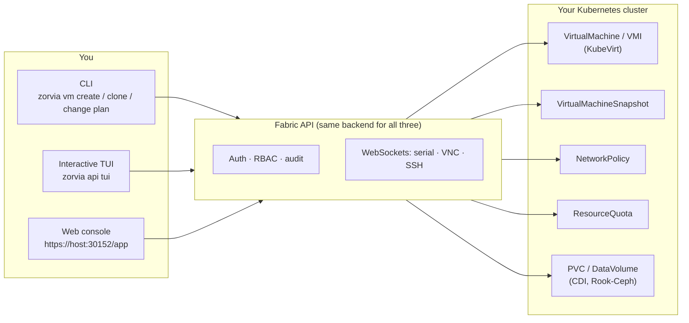

# Why Zorvia, and what is inside

The reasoning behind Zorvia and every capability, grouped by the job it does.

[Back to the README](../README.md) · [Docs index](README.md)

## Why teams pick Zorvia

KubeVirt is excellent at running VMs. What's missing is the control plane
around them — who's allowed to create what, how you hotplug and live-migrate
without downtime, how you actually reach the guest, and how you prove
afterward who did what.

Zorvia is that control plane: **one real backend** behind a CLI, a TUI, and a
web console, all driving the same Kubernetes objects underneath —
`ResourceQuota`, `NetworkPolicy`, `VirtualMachineSnapshot`, real Node
capacity, real KubeVirt migration phases. If a page shows a number, it came
from the cluster. If a button says it does something, it does it.

Run the [quickstart](getting-started.md#quick-start) in five minutes, or [talk to us](../README.md#get-involved)
about running it in production.

## What's inside

Two dozen capabilities, grouped by the job they do — not one wall of a table.

### Ship it
- **43** named OS templates — Ubuntu, Fedora, CentOS Stream, Debian, RHEL,
  Alma, Rocky, openSUSE, Alpine, Arch, Oracle, FreeBSD, Flatcar, Talos,
  Windows — no hand-written VM CRDs.
- **8** resource profiles sized by workload (`--cpus`/`--memory`/`--disk-size`,
  or apply inside a blueprint).
- **5** blueprints for multi-VM stacks: LAMP, 3-tier, k8s-cluster, CI/CD,
  dev-stack.
- Golden image library: quay.io containerdisks + CDI `image-bundle` — the web
  console's download button applies a real `DataVolume`.
- Windows plane: a Create VM wizard backed by Kryton when `KRYTON_URL` is set
  (`/app/create`, inventory at `/app/windows`).

### Run day-2, without downtime
- Hotplug CPU, memory, disk, and NIC; live migration; disk resize — from the
  CLI or the web console.
- Catch drift before it ships: `zorvia change drift` diffs desired vs. live,
  `zorvia change plan` gates a change on downtime.
- Browser ops has parity with the CLI: create, power, console, expose, and
  snapshot a VM without leaving `/app`.
- Debug the platform itself, not just the guest: the Pods page shows every
  pod with colorized live logs, an `exec -it` shell, events, and YAML in a
  Terminal.app-style panel. Restart/delete is admin-only and audited.

### Reach the guest, govern who can
- Serial, VNC, and in-browser SSH — a real pty, password auth works, all
  over authenticated WebSockets.
- Admin / user / viewer accounts at `/app/access-control`, admin-only user
  management, and last-admin-lockout protection.
- `ResourceQuota` and `NetworkPolicy` CRUD (`/app/quotas`,
  `/app/network-policies`) — server-side enforcement, not a client-only
  checkbox.
- Opt-in OIDC SSO (Beta) via `ZORVIA_OIDC_ENABLED=1`.

### Prove it, protect it
- Compliance posture checked against actual VM specs — PCI-DSS, HIPAA, SOC2
  (`/app/compliance`).
- Persistent audit trail with JSONL export (`GET /api/audit/export`) for
  whatever SIEM you already run.
- VolumeSnapshots plus scheduled backups (`/app/backups`,
  `/app/backup-scheduler`).
- Automate power state with recurring start/stop/restart (`/app/schedules`),
  and get paged on the way there — alerts and HTTPS webhooks with retry
  (`/app/alerts`, `/app/webhooks`).

### Fit more VMs, spend less
- Placement Advisor and Capacity Planning against real Node capacity
  (`/app/placement`, `/app/capacity`).
- Resource Optimizer right-sizes from real usage, not guesses
  (`/app/optimizer`).
- Zones, Analytics, and a Service Map show what's running where
  (`/app/zones`, `/app/analytics`, `/app/service-map`).
- Warm Pools keep ready-to-claim VMs on standby for burst capacity
  (`/app/warm-pools`).

### Bring your own infrastructure
- Distributed storage: Rook-Ceph pools, filesystems, and object stores, plus
  StorageClass provisioning (`/app/storage`).
- Optional pluggable storage control plane via Atlas (`ATLAS_URL`) — backend/
  RBD/object-store lifecycle, disaster recovery, AI-assisted insights,
  governance, and cloud-to-edge DB migration (its own `/app/databridge`
  page), alongside Rook-Ceph on `/app/storage`
  ([docs/ATLAS_INTEGRATION.md](ATLAS_INTEGRATION.md)).
- GitOps: a Terraform scaffold and module over the Fabric API.

Same `VirtualMachine` objects, whether you're at a terminal or in a
browser. Coming from OpenShift Virtualization? See
[leave-openshift.md](leave-openshift.md).

One Fabric API, three front ends, real objects at the other end every time.
